# Ekart - Electronics E-commerce Android App

Ekart is a Kotlin-based e-commerce Android application that allows users to browse electronics products, add items to their cart or wishlist, and place orders seamlessly.  

## 📌 Features  
- **User Authentication** (Sign Up, Login, Forgot Password)  
- **Product Catalog** with detailed item view  
- **Wishlist** for saving favorite products  
- **Shopping Cart** to manage selected items  
- **Order Placement & Orders Page**  
- **Profile Management** (Update Profile, Change Password)  
- **Secure Logout**

## 🚀 Tech Stack  
- **Language**: Kotlin   
- **UI Components**: Jetpack Compose/XML Layouts   

## 📸 Screenshots

### 🆕 Signup
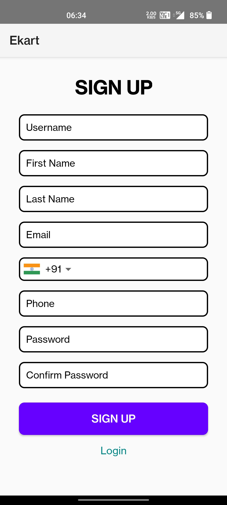

### 🔐 Login
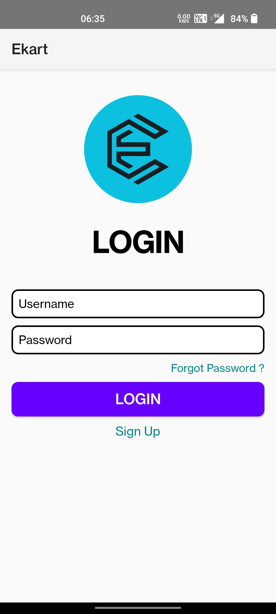

### 🏠 Home
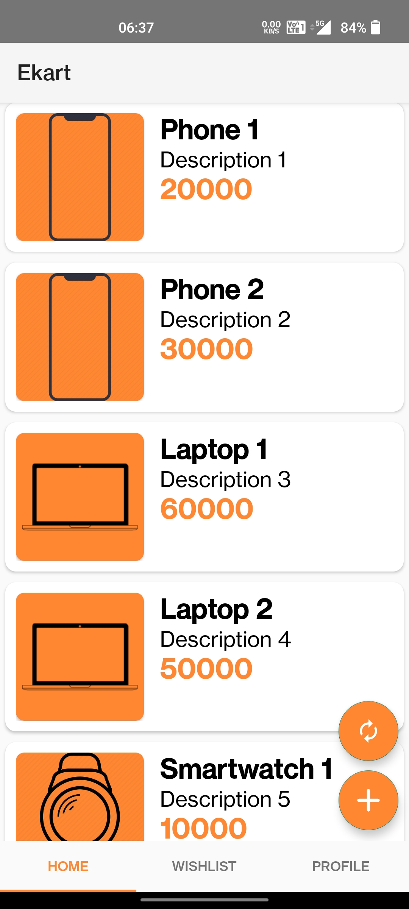

### 🔍 Item Details
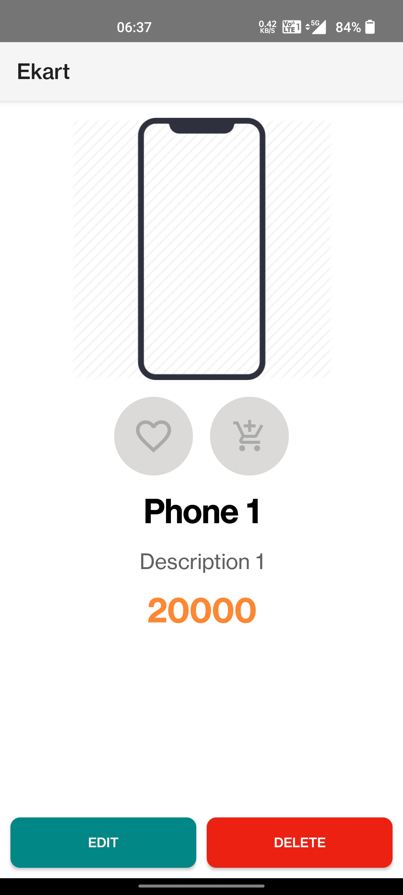

### ➕ Add Item (Admin)
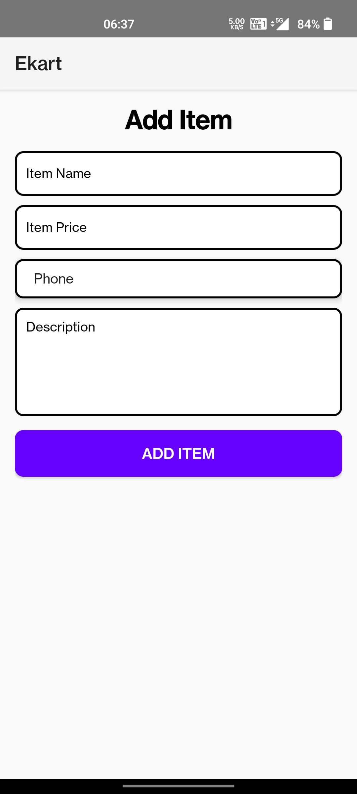

### ✏️ Edit Item (Admin)
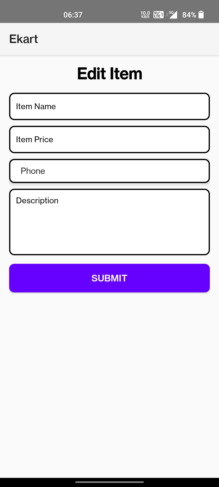

### 🙍 Profile

### 👤 Edit Profile
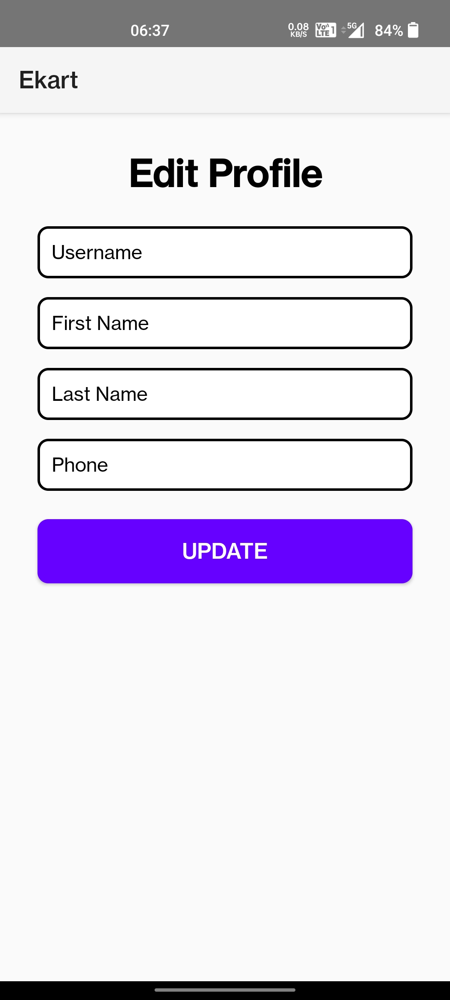

### 🛒 Cart

### ❤️ Wishlist
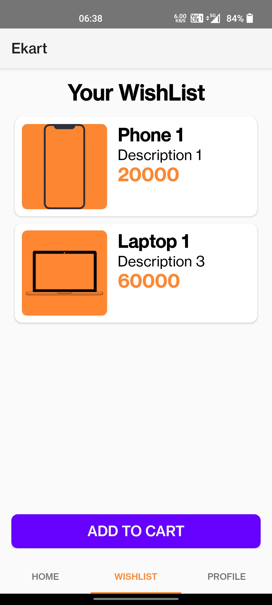

### 📦 Orders
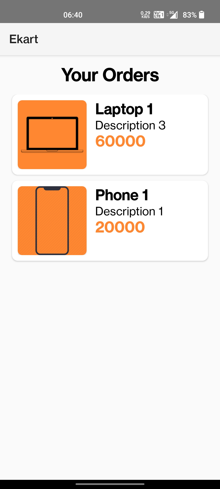

### 🧾 Order Item
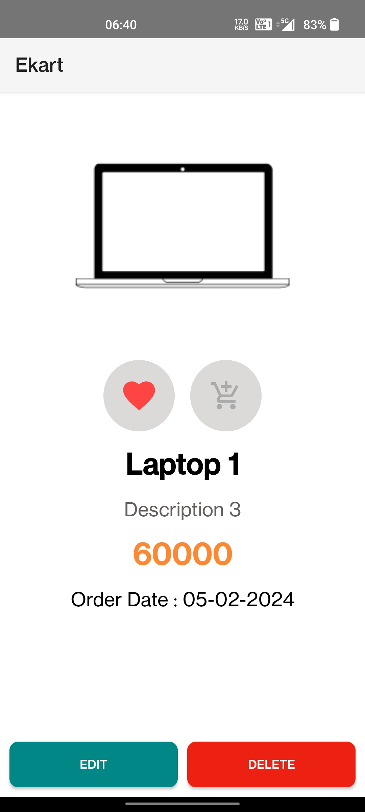

### ✅ Verify Email

### 🔑 Set Password

### 🔄 Change Password
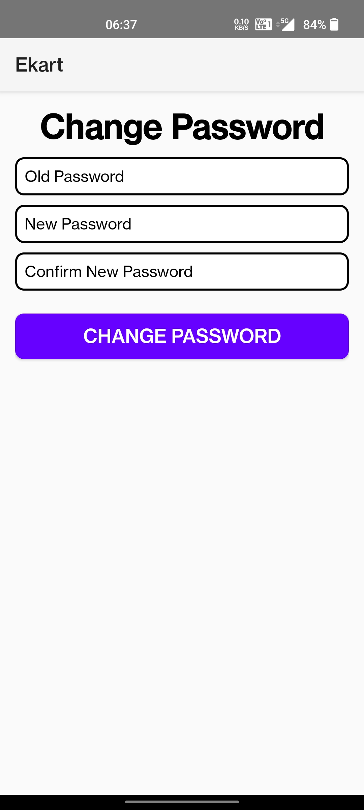
