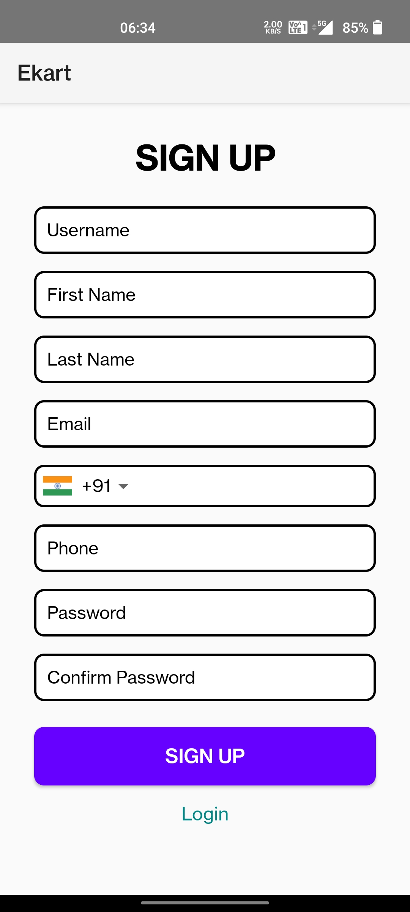
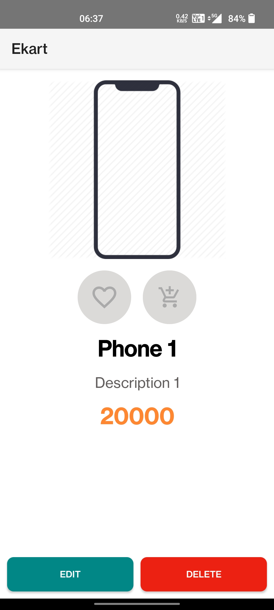
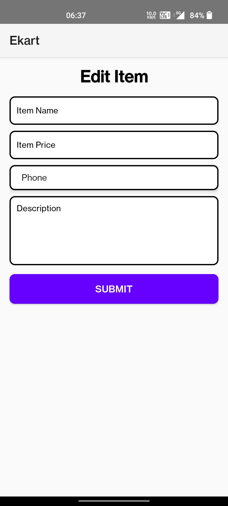
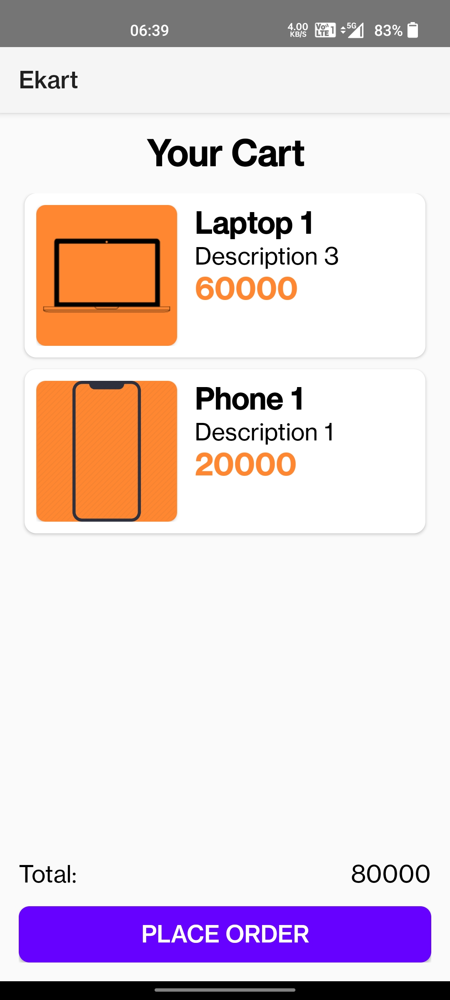
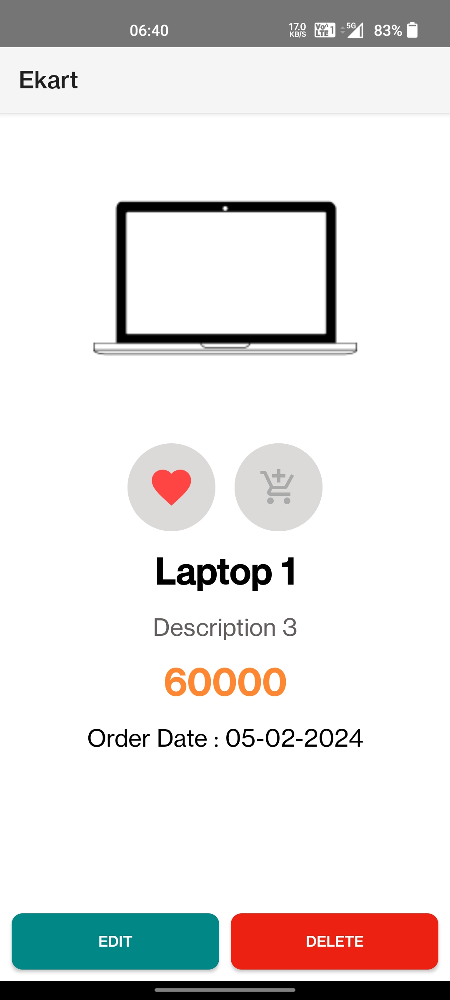

# Ekart - Electronics E-commerce Android App

Ekart is a Kotlin-based e-commerce Android application that allows users to browse electronics products, add items to their cart or wishlist, and place orders seamlessly.  

## 📌 Features  
- **User Authentication** (Sign Up, Login, Forgot Password)  
- **Product Catalog** with detailed item view  
- **Wishlist** for saving favorite products  
- **Shopping Cart** to manage selected items  
- **Order Placement & Orders Page**  
- **Profile Management** (Update Profile, Change Password)  
- **Secure Logout**

## 🚀 Tech Stack  
- **Language**: Kotlin   
- **UI Components**: Jetpack Compose/XML Layouts   

## 📸 Screenshots

### 🆕 Signup

### 🔠Login

### 🠠Home

### 🔠Item Details

### â• Add Item (Admin)

### âœï¸ Edit Item (Admin)

### 🙠Profile

### 👤 Edit Profile

### 🛒 Cart

### â¤ï¸ Wishlist

### 📦 Orders

### 🧾 Order Item

### ✅ Verify Email

### 🔑 Set Password

### 🔄 Change Password

